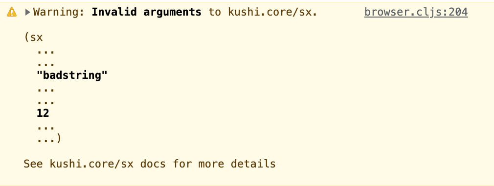

<br>

<h1>Kushi</h1>
<h5>Styling in ClojureScript</h5>

<br>

[](https://clojars.org/org.clojars.paintparty/kushi)

<br>


**Native ClojureScript styling solution**

**Shorthand syntax based on standard CSS**

**Co-locates all styles at the element level**

**Compile-time macros generate static css**

**Supports media-queries, psuedos, and combo selectors**

**Leverages CSS variables for runtime dynamics**

**Composable, user-defined shared classes**

**Ships with a small handful of useful utility classes**

**Includes a default industry-standard breakpoint scale**

**Predefined scales for typography, widths, & more**

**Auto-generated selectors to avoid pontential collisions**

**Robust and flexible selector prefixing options**

**Enhanced debugging via metadata**

**Detailed warnings for the terminal and browser**

**Framework & build-tool agnostic**

**Ships with minimal set of headless UI components**

**Themeable design token system**


<br>

# Index
[Setup and usage](#setup-and-usage)<br>
[Syntax](#syntax)<br>
[Shared styles](#shared-styles)<br>
[Media queries](#media-queries)<br>
[Pseudos and combo selectors](#pseudos-and-combo-selectors)<br>
[Prefixing options](#prefixing-options)<br>
[Using scales](#using-scales)<br>
[Injecting stylesheets](#injecting-stylesheets)<br>
[Adding font resources](#adding-font-resources)<br>
[Element attributes](#element-attributes)<br>
[Helpful metadata](#helpful-metadata)<br>
[Configuration options](#configuration-options)<br>
<!--[Runtime injection](#runtime-injection)<br>-->
[Useful warnings](#useful-warnings)<br>
[Usage with build tools](#usage-with-build-tools)<br>
[Roadmap](#roadmap)<br>
[Development](#development)<br>
[License](#license)

<br>
# Intro
<br>

# Setup and Usage
Usage with [Reagent](https://reagent-project.github.io/) + [Shadow-CLJS](https://github.com/thheller/shadow-cljs) is currently recommended.

For a well commented, feature-complete minimal project template, please see [kushi-quickstart](https://github.com/paintparty/kushi-quickstart).

<br>

# Syntax
Styles are co-located at the element level.
Simply wrap your attributes with the `kushi.core/sx` macro:
```Clojure
(ns myns.core
  (:require
   [kushi.core :refer [sx]]))

(defn my-component []
 [:div
  (sx {:id    :my-id
       :style {:color      :red
               :text-align :center
               :font-size  :18px}})])
```

<br>
Kushi promotes a simple shorthand grammer which shadows standard CSS.
The above example would be written like this:
```Clojure
(defn my-component []
 [:div
  (sx {:id    :my-id
       :style {:c  :red
               :ta :c
               :fs :18px}})])
```
<br>
If you want to go faster, write your styles as tokenized keywords.<br>
This is similar to Tachyons/Tailwind, but much more helpful in learning actual CSS (and much more intuitive if you are an existing CSS expert).
```Clojure
(defn my-component []
 [:div
  (sx :c--red
      :ta--c
      :fs--18px
      {:id :my-id})])
```
<br>
In all three examples above, the `sx` macro would return the following attribute map with an auto-generated value for the `class` attribute:
```Clojure
{:class "_680769808"
 :id    :my-id}
```

When your build finishes, the following css will be written to disk:
```css
 ._680769808 { color: red; text-align: center; font-size: 18px; }
```
<br>
If you need or want to define your own classnames, you can leverage kushi's flexible and robust [naming and prefixing options](#prefixing-options). You can supply your own classname by passing a quoted symbol as the first argument to sx:

```Clojure
(defn my-component []
 [:div
  (sx 'foobar
      :c--red
      :ta--c
      :fs--18px)])
```
The above call to `sx` would generate the following attribute map:
```Clojure
{:class "foobar"}
```


And the following css will be written to disk:
```css
 .foobar { color: red; text-align: center; font-size: 18px; }
```
<br>

In summary, the `kushi.core/sx` is a macro that returns an attribute map which contains the following:

  - A `class` property containing the correct auto-generated (or prefixed) classnames.
  - If necessary, a `style` property containing the correct auto-generated css variable names.
  - All the other attributes you specify in your attributes map (supplied as an optional last arg to `sx`).
  - A dev-build-only `data-cjs` attribute for browser debugging. See [Using metadata](#using-metadata).

All your css is written to a static file, via a build hook for the `:compile-finish` stage (or similar depending on build tool). For zippy previews when developing, styles are injected at runtime.
<!---You can optionally disable writing styles to disk and enable producton builds to [inject styles at runtime](#runtime-injection).
-->
<br>

### Styles as Keywords

Kushi aims to provide the same benefits as Tachyons/Tailwind (styling expressed as a list of tokens co-located at the element level) while minimizing some of the common downsides (learning and using a whole new abstraction layer on top of standard css).

Keywords containing `--` represent a css prop and value pair (split on `--`).


```Clojure
:color--red
```

Some more examples, using kushi's optional shorthand grammer.
```Clojure
:c--red    ; :color--red
:ai--c     ; :align-items--center
:ai--e     ; :align-items--end
:ta--r     ; :text-align--right
:bgs--50%  ; :background-size--50%
:fs--18px  ; :font-size--18px
:ff--serif ; :font-family--serif
```
This shorthand grammer is available for the most commonly used props:
```Clojure
:ai   ; :align-items
:b    ; :border
:bc   ; :border-color
:bi   ; :border-inline
:bb   ; :border-block
:bs   ; :border-style
:bw   ; :border-width
:bg   ; :background
:bgc  ; :background-color
:bgi  ; :background-image
:bgp  ; :background-position
:bgr  ; :background-repeat
:bgs  ; :background-size
:c    ; :color
:d    ; :display
:ff   ; :font-family
:fs   ; :font-size
:fv   ; :font-variant
:fw   ; :font-weight
:h    ; :height
:jc   ; :justify-content
:ji   ; :justify-items
:lh   ; :line-height
:m    ; :margin
:mb   ; :margin-block
:mbs  ; :margin-block-start
:mbe  ; :margin-block-end
:mi   ; :margin-inline
:mis  ; :margin-inline-start
:mie  ; :margin-inline-end
:o    ; :opacity
:p    ; :padding
:pb   ; :padding-block
:pbs  ; :padding-block-start
:pbe  ; :padding-block-end
:pi   ; :padding-inline
:pis  ; :padding-inline-start
:pie  ; :padding-inline-end
:ta   ; :text-align
:td   ; :text-decoration
:tt   ; :text-transform
:w    ; :width
:ws   ; :white-space
:zi   ; :z-index
```
See the complete list of supported css properties [here](https://github.com/paintparty/kushi/blob/main/doc/kushi-shorthand-reference.md).

Shorthand grammer extends to cover enumerated values:
```Clojure
;; text-decoration
:td--u   ; text-decoration--uppercase
:td--o   ; text-decoration--overline
:td--lt  ; text-decoration--line-through

;; background-repeat
:bgr--nr ; background-repeat--no-repeat
:bgr--rx ; background-repeat--repeat-x
:bgr--ry ; background-repeat--repeat-y
:bgr--r  ; background-repeat--round
:bgr--s  ; background-repeat--space

;; align-items
:ai--c   ; align-items--center
:ai--fs  ; align-items--flex-start
:ai--fe  ; align-items--flex-end
:ai--n   ; align-items--normal
:ai--s   ; align-items--start
:ai--e   ; align-items--end
:ai--b   ; align-items--baseline
```

Note that the enumerated value`:none`, as well as global properties such as `inherit`, `initial`, `revert`, `unset`, etc. are not supported with shorthand syntax:

```Clojure
;; This will NOT work
:td--r

;; This will work
:td--revert ;=> text-decoration: revert;
```
See the complete list of supported enum values [here](https://github.com/paintparty/kushi/blob/main/doc/kushi-shorthand-reference.md).

<br>

### Expressing dynamic values

Sometimes you need to use dynamic values based on application state.

```Clojure
;; Assuming there is a var defined as `mycolor` with a value of `:red`

;; For tokenized keywords, you can use a `$` char:

(sx :c--$mycolor)

;; The above is equivalent to:

(sx {:style {:color mycolor})
```

Both examples above would result in the following attribute map:
```Clojure
{:class "_617784030" :style "--mycolor:red"}
```
And the following css would be written to disk:
```css
._617784030 {color: var(--mycolor)}
```
<br>

### Using CSS custom properties

The following sugar is supported for css variables:

```Clojure
(sx :c--:--mycssvarname)

(sx {:style {:color :--mycssvarname})

;; Both of the above would be equivalent to:

(sx {:style {:color "--var(mycssvarname)"})
```
<br>

### Complex values
Sometimes, css syntax is inherently complex. In these cases, you may want or need to locate your styling in the `:style` entry of the attributes map:

When a string is desired, or necessary:
```Clojure
(sx {:style {:before:content "\"*\""
             :width "calc((100vw / 3) + 12px)"}})
```
When using `kushi.core/cssfn` to construct a value:
```Clojure
(sx {:style {:transform (cssfn :translateY :-100px)}}])
```
<br>

### Using `cssfn`
As seen in the example above, you can use `kushi.core/cssfn` to contruct values.
```Clojure
(sx {:style {:color (cssfn :rgba 0 200 100 0.4)}})

;; The above example is equivalent to:
(sx {:style {:color "rgba(0, 200, 100, 0.4)"})
```
`cssfn` will only work when used inside a call to the sx macro.

<br>

### CSS Shorthand Properties
[CSS shorthand properties](https://developer.mozilla.org/en-US/docs/Web/CSS/Shorthand_properties) are properties that let you set the values of multiple other CSS properties simultaneously. With kushi, you can write them like this:

```Clojure
;; with tokenized keyword
(sx :b--1px:solid:black)

;; with style map
(sx {:style {:b :1px:solid:black}})

;; With string
(sx {:style {:b "1px solid black"}})
```

All of the above examples will resolve to the following css declaration:
```css
border: 1px solid black;
```
Future support is planned for dynamic values passed to construction method such as `kushi.core/cssfn` or `cljs.core/str`. In the meantime, if you would like to incorporate a dynamic value into a css shorthand property, you can do it like this:
```Clojure
;; Write the shorthand with a "default" value that subsequently
;; gets overridden with a dynamic value on the specific property.
(sx {:style {:b :1px:solid:black
             :bc mycolor}}

;; Alternatively, this would work:
(let [myborder (str "1px solid " mycolor)]
   (sx {:style {:b myborder})

```
<br>

### CSS Value Lists
Sometimes multiple css values are seperated by commas to indicate they are ordered, or that there are ordered alternatives. With kushi, you can write them like this:
```Clojure
(sx :ff--FiraCodeRegular|Consolas|monospace)
```
The above will resolve to the following css declaration:
```css
font-family: FiraCodeRegular, Consolas, monospace;
```
The example below uses a list of css shorthand values in order to render multiple text-shadows in different colors:
```Clojure
(sx :text-shadow--5px:5px:10px:red|-5px:-5px:10px:blue)
```
The above will resolve to the following css declaration:
```css
text-shadow: 5px 5px 10px red, -5px -5px 10px blue;
```

<br>

# Shared Styles
The `kushi.core/defclass` macro makes it easy to create shared styles.<br>
These should be defined in a dedicated namespace, or set of dedicated namespaces, and required once in your core or main ns.

The example below will generate a data-representation of the css rule-set.
<br>This data is added to a register (an atom that exists in the build state).
<br>This css class is only written to disk if a component references it.
```Clojure
(ns myapp.shared-styles
  (:require
   [kushi.core :refer (defclass)]))

;; Note that when using a map, unlike the sx macro it
;; does not need to be a nested `:style` entry.
(defclass headline
  {:top            0
   :left           0
   :border         :1px:solid:black
   :font-size      :200px
   :text-transform :u
   :font-style     :italic
   :mix-blend-mode :darken})


;; Same as above, using kushi shorthand
(defclass headline
  {:top            0
   :left           0
   :b              :1px:solid:black
   :fs             :200px
   :tt             :u
   :fs             :italic
   :mix-blend-mode :darken})


;; Same as above, using tokenized keyword + kushi shorthand
(defclass headline
  :top--0
  :left--0
  :b--1px:solid:black
  :fs--200px
  :tt--u
  :fs--italic
  :mix-blend-mode--darken)
```
By authoring your shared styles in a dedicated ns (or namespaces), you only need to require once in your main or core ns, and all the styles from that ns will be available globally.
```Clojure
(ns myapp.core
  (:require
   [kushi.core :refer (sx)]
   [myapp.shared-styles]))

  (defn my-headline [text]
    [:h1 (sx :.headline :mt--5px) text])

;; The above call to the sx macro will return attribute map like this:
;; {:class "headline _c77789"}

;; The resulting css would be like this:

;; .headline {
;;     position: absolute;
;;     top: 0px;
;;     left: 0px;
;;     border: 1px solid black;
;;     font-size: 200px;
;;     font-style: italic;
;;     text-transform: uppercase;
;;     mix-blend-mode: darken;
;; }

;; ._c77789 {
;;     margin-top: 5px;
;; }

;; The `.headline` selector is the shared class,
;; and the `._c77789` is the autogenerated selector for margin-top rule.
```
As arguments to `sx`, classes are distinguished from other prop-styles by using a keyword beginning with a `.`, e.g. `:.headline`, as in the example above.

With `defclass`, you can mix-in any other defined classes:<br>
```Clojure
(defclass headline
  :.absolute
  :top--0
  :left--0
  :b--1px:solid:black
  :fs--200px
  :tt--u
  :fs--italic
  :mix-blend-mode--darken)
```
The `:.absolute` class is one of several predefined classes that ships with kushi.

The full list of predefined classes:

```Clojure
;; positioning
:.absolute
:.absolute-centered
:.absolute-fill
:.relative
:.fixed
:.fixed-fill

;; background-images
:.bgi-contain
:.bgi-cover
:.debug-grid
:.debug-grid-16
:.debug-grid-16-solid
:.debug-grid-8-solid

;; flex layouts
:.flex-col-c
:.flex-col-fe
:.flex-col-fs
:.flex-col-sa
:.flex-col-sb
:.flex-col-se
:.flex-row-c
:.flex-row-fe
:.flex-row-fs
:.flex-row-sa
:.flex-row-sb
:.flex-row-se

;; borders & outlines
:.bordered
:.outlined
:.pill

;; type styling
:.sans
:.italic
:.oblique
:.uppercase
:.lowercase
:.capitalize
:.full-width
:.full-width-kana

;; type weight
:.thin
:.extra-light
:.light
:.regular
:.medium
:.semi-bold
:.bold
:.extra-bold
:.heavy

;; cursor
:.pointer

;; transitions
:.transition

;; psuedo-element helper
:.content-blank

```
<!-- TODO add debug grid helpers to above list -->

Detailed documentation on the above classes can be found [here](https://github.com/paintparty/kushi/blob/main/doc/kushi-predefined-classes.css).
<br>

### Applying Classes Conditionally

You can apply classes conditionally within the `sx` macro using the following constructs: `if` `when` `cond` `if-let` `when-let` `if-not` `when-not`, and `case`.<br>
```Clojure
;; In your ns for shared styles
(defclass active-link :color--red)

;; In some other ns
(defn link [opts]
 [:a
  (sx (when (:active? opts) :.active-link)
      :bb--1px:solid:black))
  "Go"])

;; Somewhere else in your code, calling above component

[link {:active? true}]
; => [:a {:class ["active-link" "_j7338" ]}]

;; "active-link" is the selector for your custom defclass.
```
The class to be returned cannot be nested. For example, the following will not work:
```Clojure
;; This will NOT work.

(def foo true)

(defn link [opts]
 [:a
  (sx (when (:active? opts)
        (if foo :.active-link :.some-other-class))
      :bb--1px:solid:black))
  "Go"])

```
<br>

# Media Queries
```Clojure
;; Specify the font-size of an <h1> element across breakpoints
[:h1
 (sx :fs--1.25rem
     :md:fs--1.5rem
     :lg:fs--1.75rem
     :xl:fs--2rem)]
```
As in the example above, you can use preceding modifiers to set different values for a property at different breakpoints.

Kushi ships with the following, industry-standard, mobile-first breakpoint scale:
```Clojure
[:sm {:min-width :640px}
 :md {:min-width :768px}
 :lg {:min-width :1024px}
 :xl {:min-width :1280px}
 :2xl {:min-width :1536px}]
```
Both the names and values can be customized via supplying a kwargs vector (not a map) as the `:media` entry in your `kushi.edn` config file. Becuase CSS Media Queries must be explicity ordered, this scale must be written as a vector of kwargs. See [Configuration Options](#configuration-options).

Below is an example of a scale that is desktop-first and uses different names.<br>
Note that in the case of desktop-first(`max-width`), the order is reversed (relative to mobile-first / `min-width`).
```Clojure
[:desktop {:max-width :1280px}
 :tablet {:max-width :1024px}
 :mobile {:max-width :768px}
 :small {:max-width :640px}]
```
Any media-query modifier that you use must correspond to a key in the breakpoint map.

When "stacking" other modifiers (such as psuedo-classes) in front of css props, the media queries must always come first.

<br>

# Pseudos and Combo Selectors
Pseudo-classes, pseudo-elements, and combo selectors are available via modifiers:
```Clojure
[:div (sx 'foo
          :hover:c--blue
          :>a:hover:c--red
          :&_a:hover:c--gold ; The "_" gets converted to " "
          :&.bar:hover:c--pink ;  .foo.bar:hover {color: pink}
          :before:fw--bold
          :before:mie--5px
          {:style {:before:content  "\"⌫\""
                  "~a:hover:c"     :blue
                  "nth-child(2):c" :red}})
 [:span [:a "Erase"]]]
```
CSS resulting from the above example:
```css
.foo:hover {
  color: blue;
}

.foo > a:hover {
  color: red;
}

.foo a:hover {
  color: gold;
}

.foo.bar:hover {
  color: pink;
}

.foo::before {
  font-weight: bold;
  margin-inline-end: 5px;
  content: "⌫";
}

.foo ~ a:hover {
  color: blue;
}

.foo:nth-child(2) {
  color: red;
}
```
<br>

# Prefixing Options
The most common pattern for this would be setting a global `:prefix` value in your [configuration options](#configuration-options), and then providing, as your first argument to sx, a symbol with a leading `-` char (which will be used as the classname). If you do this on a project-wide basis, you will need to make sure that your all your prefix+ident values are globally unique. The kushi compiler will warn you of duplicate instances.

```Clojure
;; In your kushi.edn map ...
{:prefix :_mypfx__}

;; In one of your component namespaces ...
[:div
 (sx '-my-el :c--red)]

;; The above example will return the following attribute map:
;; {:class "_mypfx__my-el"}

;; And will write the following rule to the css file:
;; ._mypfx__my-el {
;;    color: red;
;;}
```

### Parents and ancestors
Kushi provides a special sugar token in the form of `.%` to achieve further specificity when needed with regards to parents and ancestors of the element that you are styling. This is super useful when you want to use styles that might change when, for example, a class is toggled or changed further up in the DOM.

The `.%` token is just stubby syntax for the classname that will be created, and gets stripped out of any CSS that is generated.
```Clojure
(defn my-button [text]
  [:button
   (sx 'foo
       :section.baz&_.%:color--blue  ;; when `section.foo` ancestor exists
       :section.dark>.%:color--white ;; when `section.dark` parent exists
       {:on-click #(prn "clicked!")})
     text])

```
The above will write the following css:
```css
section.baz .foo {color: blue}
section.dark > .foo {color: white}
```
If you want to use this feature in cases when you need to write you styles in a map with strings as keys, keep in mind you do not need to use the "&_" when talking about (non-direct) ancestors:
```Clojure
(sx 'foo
    {:style {"section[aria-expanded='true'] .%:color"    :blue
             "section[aria-expanded='false'] > .%:color" :white}
    :on-click #(prn "clicked!")})
```

<br>

# Defining Animations

`kushi.core/defkeyframes` macro makes it easy to define css keyframes.
```Clojure
;; This will twirl something on its y-axis
(defkeyframes yspinner
  [:0% {:transform (cssfn :rotateY :0deg)}]
  [:100% {:transform (cssfn :rotateY :360deg)}])


;; Somewhere in your component code...
[:div
 (sx :fs--32px
     :animation--yspinner:12s:linear:infinite)
 "Round & Round"]
```
Because names for css `@keyframes` definitions are used as-is in other style rules that reference the animation, kushi does not apply any auto-generated prefixing to `@keyframes` names in the generated css. If you are worried about potential collisions with your `@keyframes` definitions and some other 3rd party @keyframes definitions, you should give them a prefixed name when you define them:

```Clojure
(defkeyframes my-prefix__spinner
 ...)
```
<br>

# Using Scales
Kushi ships with two different predefined scaling systems, which provide a scale of values for `width`, `font-size`, `padding`, `margin`, and `border-widths`.

These two systems shadow the scales provided by [Tachyons](http://tachyons.io/docs/typography/scale/) and [Tailwindcss](https://tailwindcss.com/docs/font-size).

You must explicitly opt-in to use one of the scales in your `kushi.edn` config file:
```Clojure
{...
 :scaling-system :tachyons
 ...}

; or the tailwind flavor

{...
 :scaling-system :tailwind
 ...}
```

To use values from these scales, supply a value affixed with an `*` to one of the applicable css properties:
```Clojure
(sx :w--1*
    :bw--2*
    :fs--3*
    :p--sm*
    :m--md*)

;; The above is equivalent to the following

(sx :width--1rem
    :border-width--.25rem
    :font-size--1.5rem
    :padding--.5rem
    :margin--1rem)
```
View all the scale values [here](https://github.com/paintparty/kushi/blob/main/src/kushi/scales.cljc).
<br>

# Injecting Stylesheets
You can use `kushi.core/inject-stylesheet` to load css stylesheets.<br>
The example below (typical use case), loads a stylesheet from Google Fonts.
```Clojure
;; The additional "preconnect" hints will improve Google Fonts performance.

(inject-stylesheet {:rel "preconnet"
                    :href "https://fonts.gstatic.com"
                    :cross-origin "anonymous"})

(inject-stylesheet {:rel "preconnet"
                    :href "https://fonts.googleapis.com"})

(inject-stylesheet {:rel "stylesheet"
                    :href "https://fonts.googleapis.com/css2?family=Inter:wght@900&display=swap"})
```


You can also use `kushi.core/inject-stylesheet` to inject a css reset stylesheet, or a third-party style library.
This is more of an edge case, as you would typically just do this with a `<link>` in your index.html.<br>
However, if your project uses a clj file to generate the contents of your `<head>` at build time,
it may be handy to use this during development to inject new stylesheets without restarting your build.

```Clojure
(inject-stylesheet {:rel "stylesheet"
                    :href "css/my-global-styles.css"})
```
<br>

# Adding Font Resources
You can use the `kushi.core/add-font-face` macro to load a local font from a file.<br>
This will add an `@font-face` block to the css file generated by kushi.<br>
The `:src` entry must be a path (string), or vector of paths if you want to specify multiple urls.
The path(s) must be relative to the location of the generated css file.<br>
You could also use a remote url to load a hosted font file.
```Clojure
(add-font-face {:font-family "FiraCodeRegular"
                :font-weight "400"
                :font-style "normal"
                :src ["url(../fonts/FiraCode-Regular.woff)"]})
```

### System Font Stack
You can use the `kushi.core/add-system-font-stack` macro to use a system font stack.
This uses an efficient, [`@font-face`-based  approach](https://github.com/csstools/system-font-css) introduced by Jonathan Neal.
```Clojure
; In your core namespace
(add-system-font-stack)
```
The example above would add a total of 8 `@font-face` definitions to your kushi css file.
One `normal` and one `italic` for weights `300`("light"), `400`("regular"), `500`("semi-bold"), and `700`("bold"). Note that the name of the font-family kushi provides is **`sys`**, *not* `system-ui`. This is for [differentiation](https://developer.mozilla.org/en-US/docs/Web/CSS/font-family) and to [help avoid confusion](https://infinnie.github.io/blog/2017/systemui.html).

```CSS
@font-face {
  font-family: system;
  font-style: normal;
  font-weight: 300;
  src: local(".SFNS-Light"), local(".SFNSText-Light"), local(".HelveticaNeueDeskInterface-Light"), local(".LucidaGrandeUI"), local("Segoe UI Light"), local("Ubuntu Light"), local("Roboto-Light"), local("DroidSans"), local("Tahoma");
}
@font-face {
  font-family: system;
  font-style: italic;
  font-weight: 300;
  src: local(".SFNS-LightItalic"), local(".SFNSText-LightItalic"), local(".HelveticaNeueDeskInterface-Italic"), local(".LucidaGrandeUI"), local("Segoe UI Light Italic"), local("Ubuntu Light Italic"), local("Roboto-LightItalic"), local("DroidSans"), local("Tahoma");
}
/* + 6 more */
```
If you want to be more precise you can pass in only the weights you need. The example below would write a total of 4 `@font-face` rules to your kushi css file (`normal` and `italic` for both `300`("light") & `700`("bold")).
```Clojure
(add-system-font-stack 300 700)
```

Then you can use the system font stack like so:
```Clojure
[:div (sx :font-family--system)]

; Using kushi shorthand:
[:div (sx :ff--system)]

; An example using kushi syntax to specify multiple values for the css shorthand `font` property.
[:div (sx :font--italic:700:system)] ;

```

<br>

# Helpful Metadata
Relative to using vanilla css or sass, kushi will obviate the need to write your styles in a separate location and/or language. In turn, you will not need to worry about keeping selector names in css files synced with classnames in your markup code.

With kushi, elements in the DOM will have auto-generated class names. As a result, it can become difficult to quickly comprehend the source location when looking at elements in a browser inspector (such as Chrome DevTool Elements panel).

During development builds, the `sx` macro will automatically attach a `data-cljs` attribute to the DOM element. The value of this is the file name, line number, and column number of the source.
```Clojure
(ns myapp.core
  (:require
   [kushi.core :refer (sx)]))

;; A component defined, for example, on line 170
(defn my-button [text]
  [:button
   (sx :c--white
       :bgi--none
       :bgc--blue
       :border-radius--5px
       :cursor--pointer)
     text])
```
You would see something like this in the browser console, when inspecting an element rendered from this function:
```html
<div data-cljs="myapp.core.cljs:172:4" class="_h30702"">
  Button Text
</div>
```
If you would like to change the name of this attribute to something else (for example, `data-foo`), simply supply a `:data-attr-name` entry with a value of `:data-foo` in your `kushi.edn` config map.

<br>
<br>

# Configuration Options
Various options are configurable via a required `kushi.edn` file.<br>
This file must live in your project's root directory.

The only required entry in this map is `:css-dir`

```Clojure
{
 ;; REQUIRED.
 ;; Must be relative to proj root e.g "public/css" or "resources/public/css".
 :css-dir "public/css"
}
```
Below is a full map of all the options available:
```Clojure
{
 ;; REQUIRED.
 :css-dir "public/css"

 ;; Optional. Name of generated css file.
 ;; Defaults to "kushi.css".
 :css-filename "my-kushi-styles.css"

 ;; Optional. Set to false if you don't want css files
 ;; written to disk for release builds.
 ;; Defaults to true.
 :write-stylesheet? false

 ;; Optional. Narrow kushi compilation down to select namespaces.
 :select-ns [app.ui.foo app.ui.bar]
 ;; :select-ns [app.ui.*] ;; will target all namespaces under app.ui

 ;; Optionally prepend an ancestor element to selectors.
 ;; Useful for scoping.
 :ancestor "#my-target-div"

 ;; Optional. If defined, AND an custom classname value (with a
 ;; leading `-` char) is supplied at the `sx` call site, this will
 ;; be concatenated to the locally supplied value and used for
 ;; the classname, instead of an auto-generated name.
 :prefix "_my-prefix_"

 ;; Optional. If defined, this will be used as the prefix for
 ;; the classnames of shared styles (defined with defclass).
 ;; Defaults to nil
 :defclass-prefix "_my-shared-class-prefix_"

 ;; Optional. If defined, this will be used as an attribute
 ;; name for attaching source file info to the rendered
 ;; element in the DOM (dev only).
 ;; Defaults to "data-cljs"
 :data-attr-name "data-foo"

 ;; Optionally defined your own breakpoint scale to override
 ;; kushi's default breakpoint scale.
 ;; This must be a vector of kwargs, not a map.
 :media [:2xl {:max-width :1536px}
         :xl {:max-width :1280px}
         :lg {:max-width :1024px}
         :md {:max-width :768px}
         :sm {:max-width :640px}]

 ;; Optional setting for printing-style of kushi compilation
 ;; info to the console running your build.
 ;; Defaults to :simple.
 :reporting-style :banner

 ;; Optional setting to silence the post-build report.
 ;; Defaults to true.
 :post-build-report?  false
}
```
<!--

;; Optional. Set to true if you want runtime
;; injection for release builds.
;; Defaults to false.
:runtime-injection? true

:select-ns            nil
:post-build-report?   true
:report-cache-update? true
:reporting-style      :simple
:warning-style        :banner
:data-attr-name       nil
:css-dir              nil
:write-stylesheet?    true
:runtime-injection?   false
:handle-duplicates    nil
-->
<br>


# Useful Warnings
Given the following:
```Clojure
(sx :.relative
    :ta--center
    "badstring"
    :.sans
    :p--10px
    12
    :fs--18px
    :c--#efefef)
```

You will receive warnings about invalid args in the terminal:

<br>

<br>

And also in your browser's dev console:



<br>
The browser console warning will provide you with file and line info.

<br>
<br>

# Defining Components
Below is a contrived example of creating a reusable, stateless, and composable component using `kushi.ui.core/defcom`.


```Clojure
(ns myapp.core
  (:require
   [kushi.core :refer [sx]]
   [kushi.ui.core :refer [defcom]]))

(defcom my-section
  (let [{:keys [label label-attrs body-attrs]} &opts]
    [:section
     &attrs
     (when label
       [:div label-attrs label])
     [:div body-attrs &children]]))
```

`defcom` is a macro that returns a component rendering function which accepts an optional attributes map, plus any number of children. This means the signature at the call site mirrros hiccup itself.

Under the hood, defcom pulls out any keys in attr map that start with `:-` and put them in a separate `opts` map. This allows passing in various custom options within the attributes map that will not clash with existing html attributes. This opts map can referenced be referenced in the defcom body with the `&opts` binding. `&attrs` and `&children` are also available. This ampersand-leading naming convention takes its cue from the special `&form` and `&env` bindings used by Clojure's own `defmacro`.

Assuming your are using something like Reagent, you can use the resulting `my-section` component (from the above example)
in your application code like so:

```Clojure
;; Basic, no label
[my-section [:p "Child one"] [:p "Child two"]]

;; With optional label
[my-section (sx {:-label "My Label"}) [:p "Child one"] [:p "Child two"]]

;; With all the options and additional styling
[my-section
 (sx
  'my-section-wrapper    ; Provides custom classname (instead of auto-generated).
  :.xsmall               ; Font-size utility class.
  :p--1rem               ; Padding inside component.
  :b--1px:solid-black    ; Border around component.
  {:-label "My Label"
   :-label-attrs (sx :.huge :c--red)
   :-body-attrs (sx :bgc--#efefef)})
 [:p "Child one"]
 [:p "Child two"]]

```
<br>

###Manually defining complex components

 If, for some reason, you don't want use the `defcom` to define your complex components, you can use the same underlying pattern that defcom abstracts. This component definition pattern relies on using the `kushi.ui.core/opts+children` helper fn. It optionally makes use of the kushi.core/merge-sx to enable decoratability, and also uses the `(into [:div ] ...)` for the parent node of the `children`.

The `my-section` function below would result in the exact same component as the previous example that used `defmacro`.

```Clojure
(ns myapp.core
  (:require
   [kushi.core :refer [sx]]
   [kushi.ui.core :refer [opts+children]]))

(defn my-section
  [& args]
  (let [[opts attrs & children]  (opts+children args)
        {:keys [label label-attrs body-attrs]} opts]
    [:section
     attrs
     (when label
       [:div label-attrs label])
     (into [:div body-attrs] children)]))
```

The example above assumes the following:

- The args list in the function definition is variadic
<br>
- The optional attributes map may contain the custom attributes `:-label`, `:-label-attrs`, `:-body-attrs`.
<br>
- The values of `:-label-attrs` and `:-body-attrs` are html attribute maps.

The helper function `kushi.ui.core/opts+children` will pull any keys prefixed with `:-` out of the attributes map and into a user `opts` map. `opts+children` always returns a vector in the form of `[user-opts attr child & more-childs]`.

<!-- ### Theming
You can theme -->
<!-- <br> -->

<br>

# Usage with Build Tools
Although Kushi is designed to be build-tool and framework agnostic, thus far it has only been used in production with
[Reagent](https://reagent-project.github.io/) + [Shadow-CLJS](https://github.com/thheller/shadow-cljs).

### shadow-cljs
See the [kushi-quickstart](https://github.com/paintparty/kushi-quickstart) template for a detailed example of using Kushi in a shadow-cljs project.

<br>

# Roadmap
...more info coming soon.

<br>

# Development
...more info coming soon.

<br>

# License

Copyright © 2021-2022 Jeremiah Coyle

Distributed under the EPL License. See LICENSE.
