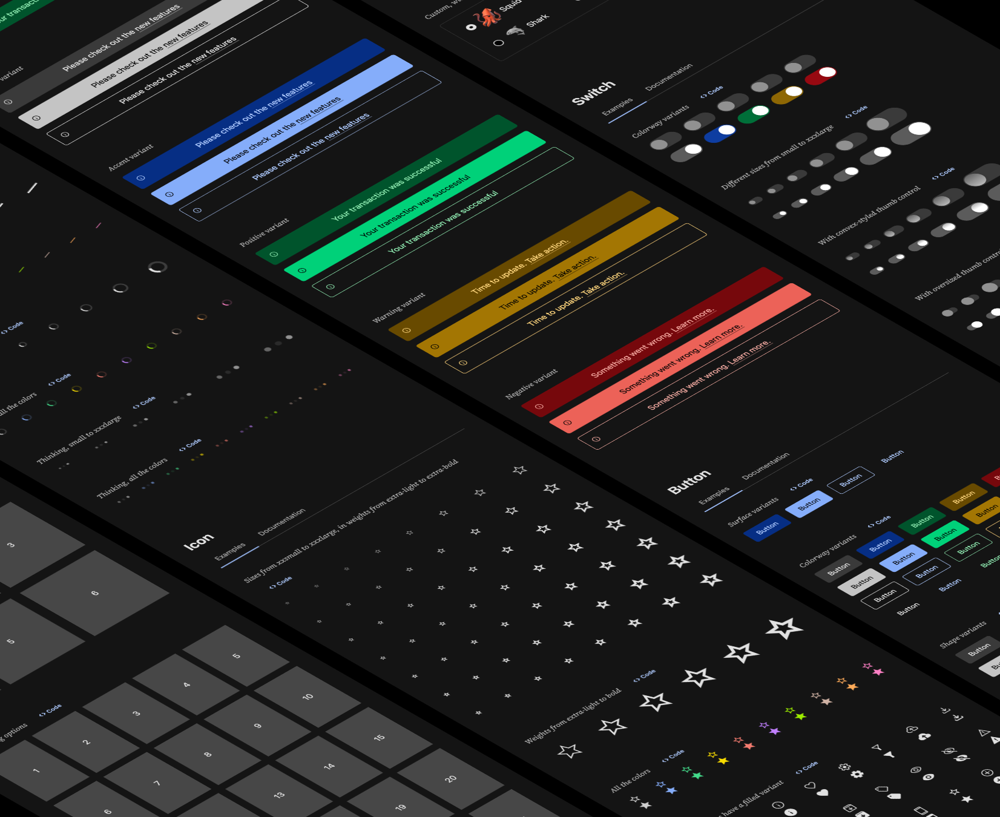
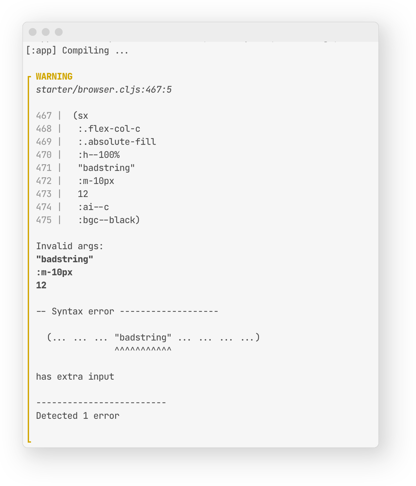

<p><sub>Many thanks to <a href="https://www.clojuriststogether.org/">Clojurists Together</a> for generously supporting this project!</sub></p>

<br>
<div align="center"></img></div> 
<br>

# Kushi
<h5>Kushi is a foundation for building web UI with ClojureScript.</h5>
<h5><a href="https://kushi.design" target="_blank"><strong>Explore Kushi UI Playground »</strong></a></h5>
<h5><a href="https://github.com/kushidesign/kushi-quickstart" target="_blank"><strong>Kushi Quickstart »</strong></a></h5>


<br>

## Features
- **100% Clojure(Script)**

- **Suite of accessible,  headless UI components**

- **Themeable design system foundation**

- **Co-location of styling at the element level**

- **Shorthand styling syntax shadows CSS standard**

- **Supports media-queries, psuedos, and combo selectors**

- **Leverages CSS variables for runtime dynamics**

- **Composable, user-defined shared classes**

- **Many useful CSS utility classes**

- **Default industry-standard breakpoint scale**

- **Auto-generated selectors to avoid pontential collisions**

- **Flexible selector prefixing options**

- **Helpers for typography, keyframe animations, and more**

- **Enhanced debugging via metadata**

- **Detailed, human-readable warnings**

- **Framework & build-tool agnostic**

- **Generates interactive UI documentation**

<br>

> [!WARNING]
>
> If your project is using Kushi `v1.0.0-a.22` or lower, please reference the readme on a different branch that corresponds with the version that you are using:<br>
> [v1.0.0-a.18](https://github.com/kushidesign/kushi/tree/alpha18-fixes)<br>
> [v1.0.0-a.19](https://github.com/kushidesign/kushi/tree/cssvar-tuples-defclass)<br>
> [v1.0.0-a.20](https://github.com/kushidesign/kushi/tree/tooltip2)<br>
> [v1.0.0-a.21](https://github.com/kushidesign/kushi/tree/playground-update2)<br>
> [v1.0.0-a.22](https://github.com/kushidesign/kushi/tree/refactor-warnings-and-errors)<br>
 


<br>

## Table of Contents
- [Introduction](#introduction)<br>
- [Project Status](#project-status)<br>
- [Setup and usage](#setup-and-usage)<br>
- [Kushi styling syntax](#kushi-styling-syntax)<br>
- [Shared styles](#shared-styles)<br>
- [Styles as tokenized keywords](#styles-as-tokenized-keywords)<br>
- [Working with media queries](#working-with-media-queries)<br>
- [Pseudos and combo selectors](#pseudos-and-combo-selectors)<br>
- [Selector prefixing options](#selector-prefixing-options)<br>
- [Defining CSS at-rules](#defining-css-at-rules)<br>
- [Injecting stylesheets](#injecting-stylesheets)<br>
- [Configuration options](#configuration-options)<br>
- [Actionable warnings](#actionable-warnings)<br>
- [Defining components](#defining-components)<br>
- [Kushi Playground](#kushi-playground)
- [Usage with build tools](#usage-with-build-tools)<br>
- [Contributing](#contributing)<br>
- [License](#license)

<br>

## Introduction
Kushi provides a comprehensive solution for creating and evolving web-based UI
projects in ClojureScript.

The following features work in concert, making it easy to roll your own design
system:
- A set of professionally designed, themeable, headless UI components
- Solid foundation of hand-tuned global design tokens
- Functional styling engine
- Configurable theming

Usage of Kushi's design system and component library is completly optional. You
can just use the styling engine as a pure ClojureScript alternative to
mainstream JS solutions such as Tailwind, Emotion, etc.

<br>

## Project status
Current version is pre-release intended for early adopters and anyone who would
like to provide feedback. New 1.0 alphas will be released frequently, while I
continue to make improvements/changes/additions. Working towards a stable 1.0
release by end of Q2 of 2025.


Please report anything unexpected on GitHub Issues.

<br>

## Setup and Usage
[](https://clojars.org/design.kushi/kushi)

Usage with [Reagent](https://reagent-project.github.io/) +
[Shadow-CLJS](https://github.com/thheller/shadow-cljs) is currently recommended.

Please check out
[Kushi Quickstart](https://github.com/kushidesign/kushi-quickstart) for a well
commented, feature-complete minimal project template. This is probably the
easiest way to get started with Kushi.

Checkout the
<a href="https://kushidesign.github.io/kushi/public/index.html" target="_blank">
interactive playground</a> of pre-built headless UI components.
<br>


<!--Intro section for ui lib vs user guide -->

## Build system basics
Currently, Kushi depends on the [`shadow-cljs`](https://github.com/thheller/shadow-css)
build-hook system to generate and bundle CSS. The `sx` and `css` macros return
an html attributes map or class string, respectively. The CSS is transpiled and
generated in a separate analyzation phase triggered by `kushi.css.build.analyze/hook`.
By default, [`lightningcss`](https://lightningcss.dev/) is leveraged to achieve
fast and efficient minification, bundling, vendor prefixing, and syntax-lowering
(to target older browsers).

<br>

## Kushi styling syntax

### Basic usage of the `css` macro

Styles are co-located at the element level. You don't need to think about
choosing an appropriate classname, as it is generated automatically. The macro
`kushi.core/css` takes any number of styles:

```Clojure
(ns myns.core
  (:require
   [kushi.core :refer [css]]))

(defn my-component []
 [:div
  {:class (css :c--red
               :ta--c
               :fs--18px)}])

```

As you can see in the above example, Kushi promotes a simple
tokenized-keyword-based shorthand grammar which shadows standard CSS. This
approach is similar solutions such as Tachyons and Tailwind, but much more
helpful in learning actual CSS, and much more intuitive if you are an existing
CSS expert.


In the example above, the `css` macro would expand to the following (shown in
context):

```Clojure
(defn my-component []
 [:div
  {:class "myns_core__L7C11"}])
```

When your build finishes, the following css will be written to disk:

```css
.myns_core__L7C11 {
  color: red;
  text-align: center;
  font-size: 18px;
}
```
Check out the [Styles as tokenized keywords](#styles-as-tokenized-keywords)
section for more details on Kushi's shorthand grammar.

Note that the shorthand grammar is totally optional - you can also write these
tokenized keywords with fully hydrated props and values.
```Clojure
(defn my-component []
 [:div
  {:class (css :color--red
               :text-align--center
               :font-size--18px)}])
```

If you have an aversion to the tokenized keyword approach, you can also just use
a map - check out the [Using maps](#using-maps) section. 

<br>

### Supplying additional classes to the `css` macro

You can supply additional classes as needed. These classes might be shared
classes that you have defined, utility classes that ship with Kushi, or classes
from 3rd party libraries. They must take the form of a keyword prefixed with a
dot: 

```Clojure
(defn my-component []
 [:div
  {:class (css :.absolute-centered
               :.text-large
               :c--red
               :ta--c
               :fs--18px)])
```
The above call to `css` would expand to the following class string:
```Clojure
"myns_core__L7C11 absolute-centered text-large"
```

<br>

### Supplying dynamic classes to the `css` macro

If you want to supply classes conditionally, based on runtime logic, you can do
so like this:

```Clojure
(defn my-component [positioning-class]
 [:div
  {:class (css positioning-class
               :c--red
               :ta--c
               :fs--18px)])

;; At call site
[my-component "absolute-centered"]
```

The above call to `css` would expand to the following:
```Clojure
(str "myns_core__L7C11 " positioning-class)

;; At runtime, based on the example call-site value, this would resolve to:
"myns_core__L7C11 absolute-centered"" 
```

<!-- Another example of supplying classes conditionally:

```Clojure
(defn my-component [font-size-class]
 (let [a (when (= font-size-class "text-xlarge")
           "absolute")]
   [:div
    {:class (css a
                 font-size-class
                 :c--red
                 :ta--c
                 :fs--18px)])

;; At call site
[my-component "text-xlarge"]
```
The above call to `css` would expand to the following:
```Clojure
(str "myns_core__L7C11 " a " " font-size-class)

;; At runtime, based on the example call-site value, this would resolve to:
"myns_core__L7C11 absolute text-xsmall"
``` -->

You can also define more than one class using `css` and apply one conditionally:

```Clojure
(defn my-component [k]
 (let [foo-class (css :c--red :bgc--black :fs--48px)
       bar-class (css :c--blue :bgc--gray :fs--28px)
       baz-class (css :c--orange :bgc--beige :fs--18px)
       my-class (case k
                  :foo foo-class
                  :bar bar-class
                  :baz baz-class
                  nil)]
   [:div
    {:class my-class}])

;; At call site
[my-component :foo]
```

<br>

### Using css custom properties (aka css variables) with the `css` macro.
In the tradition of Sass and Less, Kushi uses a leading `$` syntax for css
custom properties

The example below uses `:c--$red-500`, which will set the `color` property to
`var(--red-500)`. In this case, `var(--red-500)` is a global variable that is
predefined within the design token system that ships with Kushi.

```Clojure
(defn my-component []
 [:div
  {:class (css :.absolute
               font-size-class
               :c--$red-500
               :ta--c
               :fs--18px)])
```
<br>

### Supplying dynamic values for individual css properties with the `css` macro.
If you want to supply dynamic values for individual css properties, you can
utilize the `kushi.core/css-vars` macro, or the `kushi.core/css-vars-map` macro
(if you are using React under the hood). This will create a "local" custom css
property in the `style` attribute that you will then reference within your call
to `css` using the `$` css variable syntax:

```Clojure
(defn my-component [text-color]
 [:div
  {:style (css-vars text-color)
   :class (css :.absolute
               font-size-class
               :c--$text-color
               :ta--c
               :fs--18px)])

;; At call site
[my-component "red"]
```

In the example above, the `css` macro, and the `css-vars` macro would expand to
the following (shown in context):
```Clojure
(defn my-component [text-color]
 [:div
  {:style (str "--text-color: " text-color)
   :class "myns_core__L7C11"}])
```

When your build finishes, the following css will be written to disk:

```css
.myns_core__L7C11 {
  color: var(--text-color);
  text-align: center;
  font-size: 18px;
}
```

If you are using Kushi with a React abstraction such as reagent, you will
probably want use the `kushi.core/css-vars-map` macro instead, which would
expand to this:

```Clojure
(defn my-component [text-color]
 [:div
  {:style {"--text-color" text-color}
   :class "myns_core__L7C11"}])
```

<br>

### Reducing ceremony with the `sx` macro
If you don't need to use dynamic values as in the example above, and you don't
need to supply html attributes other than `class`, you can use use the
`kushi.core/sx` macro to style elements and reduce some of the boilerplate.
It works the same as the `css` macro, but returns a map with a `:class` entry
instead of a string:

```Clojure
(ns myns.core
  (:require
   [kushi.core :refer [css sx]]))

(defn my-component []
 [:div
  (sx :c--red
      :ta--c
      :fs--18px)}])
```

Which would expand to the following (shown in context):

```Clojure
(defn my-component []
 [:div
  {:class "myns_core__L7C11"}])
```


<br>

### Modifier syntax: pseudo-classes 
Kushi offers a modifier syntax for conveniently describing things like
pseudo-classes:

```Clojure
(css :c--red
     :hover:c--blue
     :hover:td--u)
```

The above example produces the following css:
```css
.myns_core__L7C11 {
  color: red;
  &:hover {
    color: blue;
    text-decoration: underline;
  }
}
```

<br>

### Modifier syntax: nested selectors
You can use the same modifier syntax for nested selectors. Underscore chars `_`
are transformed to a spaces:

```Clojure
(css :c--red
     :>p:c--teal
     :>p.foo:c--orange
     :_a:c--purple)
```

The above example produces the following css:
```css
.myns_core__L7C11 {
  color: red;
  &>p {
    color: teal;
    &.foo {
      color: orange;
    }
  }
  & a {
    color: purple;
  }
}
```

<br>

### Modifier syntax: breakpoints 

You can use the same modifier syntax for media queries:

```Clojure
(css :fs--18px
     :lg:fs--22px)
```
The above example produces the following css:
```css
.myns_core__L7C11 {
  font-size: 18px;
  @media (min-width: 1024px) {
    font-size: 22px;
  }
}
```
See the [Working with media queries](#working-with-media-queries) section for
more details on media queries and Kushi's default breakpoint scale.

<br>

### Modifier syntax: dark-mode 
Using the modifier syntax for dark-mode styling:

```Clojure
(css :c--black
     :dark:c--white)
```
The above example produces the following css:
```css
.myns_core__L7C11 {
  color: black; 
  .dark & {
    color: white;
  }
}
```
See the [Working with dark-mode](#working-with-dark-mode) section for more
details on media queries and Kushi's built-in functionality for dark-mode.

<br>

### Modifier syntax: stacking

These modifiers are designed to be "stacked". They must be separated with a
colon and the order must be media-query (optional), dark-mode (optional), then
 any sequence of selectors and pseudo-class/pseudo-elements:

```Clojure
(css :c--black
     :hover:c--red
     :lg:hover:c--orange
     :dark:c--white
     :dark:hover:c--hotpink
     :lg:dark:hover:c--yellow
     :lg:dark:hover:>div.foo:c--silver)
```
The above example produces the following css:
```css

.myns_core__L7C11 {
  color: black;
  @media(min-width: 1024px) {
    .dark & {
      &:hover {
        color: yellow;
        &>div.foo {
          color: silver;
        }
      }
    }
    &:hover {
      color: orange;
    }
  }
  .dark & {
    color: white;
    &:hover {
      color: hotpink;
    }
  }
  &:hover {
    color: red;
  }
}
```

<br>

### Using maps 
If Kushi's tokenized keyword syntax isn't your speed, your can also just use
maps to describe your all your styles:

```Clojure
(css {:color      :red
      :text-align :center
      :font-size  :18px})
```


You can also mix in maps with tokenized keywords. Maps are very useful when you
want to use nesting to avoid repetition:

```Clojure
(css :c--red
     {:hover {:c   :blue
              :td  :underline
              :bgc :yellow}})
```

The above example produces the following css:
```css
.myns_core__L7C11 {
  color: red;
  &:hover {
    color: blue;
    text-decoration: underline;
    background-color: yellow;
  }
}
```

You can nest as deep as you want:
```Clojure
(css :c--red
     {:>p {:hover {:c   :blue
                   :td  :underline
                   :bgc :yellow
                   :_a  {:c   :purple
                         :td  :none
                         :bgc :pink}}})
```

The above example produces the following css:
```css
.myns_core__L7C11 {
  color: red;
  &>p {
    &:hover {
      color: blue;
      text-decoration: underline;
      background-color: yellow;
      & a {
        color: purple;
        text-decoration: none;
        background-color: pink;
      }
    }
  }
}
```

<br>

The following is a more complex example taken from a working codebase.
There is a single map entry that defines styles for some direct descendant
elements in a sidenav. The styles only apply, however, if the element targeted
by the selector has an ancestor that matches
`"nav[data-foo-bar-sidenav][aria-expanded=\"true\"]`.
This works because of the appended `&` character:

```Clojure
(css {"nav[data-foo-bar-sidenav][aria-expanded=\"true\"] &"
      {:>.sidenav-menu-icon:d  :none
       :>.sidenav-close-icon:d :inline-flex
       :>ul:h                  "calc((100vh - (var(--navbar-height) * 2)) * 1)"
       :o                      1}}
```

The above example produces the following css:

```css
.myns_core__L7C11 {
  nav[data-foo-bar-sidenav][aria-expanded="true"] & {
    &>.sidenav-menu-icon {
      display: none;
    }
    &>.sidenav-close-icon {
      display: inline-flex;
    }
    &>ul {
      height: calc((100vh - (var(--navbar-height) * 2)) * 1);
    }
    opacity: 1;
  }
}
```

<br>

<!-- ### Using vectors
You may want or need to express a style as a 2-element vector.

When a string is desired, or necessary:
```Clojure
(sx [:before:content "\"$\""]
    [:width "calc((100vw / 3) + 12px)"])
```
When constructing a value using css function syntax:
```Clojure
(sx [:transform '(translateY :-100px)]])
``` -->

### CSS Shorthand Properties
[CSS shorthand properties](https://developer.mozilla.org/en-US/docs/Web/CSS/Shorthand_properties)
are a fundamental feature of CSS. They are properties that let you set the
values of multiple other CSS properties simultaneously. With Kushi, you can
write them like this:

```Clojure
;; with tokenized keyword
(css :b--1px:solid:black)

;; if using a map
(css {:b :1px:solid:black})

;; same as above, with string
(css {:b "1px solid black"})


```

All of the above examples will resolve to the following css declaration:
```css
border: 1px solid black;
```
<br>

### CSS Value Lists
In css, sometimes multiple values are seperated by commas to indicate they are
ordered, or that there are ordered alternatives. With Kushi, you can write them
like this:
```Clojure
(css :ff--FiraCodeRegular|Consolas|monospace)
```
The above will resolve to the following css declaration:
```css
font-family: FiraCodeRegular, Consolas, monospace;
```
The example below uses a list of css shorthand values in order to render
multiple text-shadows in different colors:
```Clojure
(css :text-shadow--5px:5px:10px:red|-5px:-5px:10px:blue)
```
The above will resolve to the following css declaration:
```css
text-shadow: 5px 5px 10px red, -5px -5px 10px blue;
```

<br>
<br>

## Shared Styles
`kushi.core/defcss` is intended for the creation of shared styles.

These shared styles should be defined in a dedicated namespace, or set of
dedicated namespaces, and required once in your core or main ns.

`defcss` takes a selector (string) as the first argument, followed by any number
of style arguments. Any style argument that is valid for `css` macro is valid
for `defcss`.

```Clojure
(ns myapp.shared-styles
  (:require
   [kushi.core :refer [defcss]]))


;; Using tokenized keywords
(defcss ".headline"
  :ta--left
  :w--100%
  :ff--Inter|system-ui|sans-serif
  :fw--900
  :fs--24px
  :tt--u
  :mix-blend-mode--darken)


;; Tokenized-keywords + usage of a map for css function syntax
(defcss ".headline2"
  :top--0
  :left--0
  :b--1px:solid:black
  :fs--200px
  :tt--u
  :mix-blend-mode--darken
  {:c "rgba(155 155 155 / 0.8)"})


;; Example using a single map.
(defcss ".headline3"
  {:top               0
   :left              0
   :b                 :1px:solid:black
   :fs                :200px
   :tt                :u
   :mix-blend-mode    :darken
   :c                 "rgba(155 155 155 / 0.8)"})
```

By authoring your shared styles in a dedicated ns (or namespaces), you only need
to require once in your main or core ns, and all the styles from that ns will be
available globally.
```Clojure
(ns myapp.core
  (:require
   [kushi.core :refer [sx]]
   [myapp.shared-styles]))

  (defn my-headline [text]
    [:h1 (sx :.headline :mt--5px) text])
```


<!-- TODO Update this, making sure it is accurate with latest version -->

<!-- With `defclass`, you can mix-in any other defined classes:<br>
```Clojure
(defclass headline
  :.flex-row-fs
  :top--0
  :left--0
  :b--1px:solid:black
  :fs--200px
  :tt--u
  :fs--italic
  :mix-blend-mode--darken)
```


(defclass headline-colored
  :.headline
  :c--red
  :b--1px:solid:pink)
```

In the example above, the `:.headline` class is one of several predefined
classes that ships with kushi. -->


<!-- TODO Update this -->
<!-- <br>

### Kushi's predefined utility classes:

```Clojure
;; Positioning

:.absolute
:.absolute-centered
:.absolute-fill
:.relative
:.fixed
:.fixed-fill


;; Background-images

:.bgi-contain
:.bgi-cover
:.debug-grid
:.debug-grid-16
:.debug-grid-16-solid
:.debug-grid-8-solid


;; Flex layouts

:.flex-col-c
:.flex-col-fe
:.flex-col-fs
:.flex-col-sa
:.flex-col-sb
:.flex-col-se
:.flex-row-c
:.flex-row-fe
:.flex-row-fs
:.flex-row-sa
:.flex-row-sb
:.flex-row-se


;; Borders & outlines

:.bordered
:.outlined
:.pill


;; Type styling

:.sans
:.italic
:.oblique
:.uppercase
:.lowercase
:.capitalize
:.full-width
:.full-width-kana


;; Type weight

:.thin
:.extra-light
:.light
:.regular
:.medium
:.semi-bold
:.bold
:.extra-bold
:.heavy


;; Cursor

:.pointer


;; Transitions

:.transition


``` -->
<!-- TODO add debug grid helpers to above list -->


<!-- TODO update this with latest file path -->
<!-- Checkout
<a href="https://github.com/kushidesign/kushi/blob/main/src/kushi/ui/utility.cljc"
   target="_blank">this source file</a>
 for a complete reference of all current pre-defined utility classes.
<br> -->

<br>

## Styles as tokenized keywords
With the `css`, `sx`, and `defcss` macros, the simplest and most convenient way
to describe styles is the usage of tokenized keywords. These keywords contain a
`--`, and represent a css prop and value pair (split on `--`).


```Clojure
:color--red
```

More examples, using Kushi's optional shorthand grammer.
```Clojure
:c--red    ; :color--red
:ai--c     ; :align-items--center
:ai--e     ; :align-items--end
:ta--r     ; :text-align--right
:fs--18px  ; :font-size--18px
:ff--serif ; :font-family--serif
```
This shorthand grammer is available for the most commonly used props:
```Clojure
:ai   ; :align-items
:b    ; :border
:bc   ; :border-color
:bi   ; :border-inline
:bb   ; :border-block
:bs   ; :border-style
:bw   ; :border-width
:bg   ; :background
:c    ; :color
:d    ; :display
:ff   ; :font-family
:fs   ; :font-size
:fv   ; :font-variant
:fw   ; :font-weight
:h    ; :height
:jc   ; :justify-content
:ji   ; :justify-items
:lh   ; :line-height
:m    ; :margin
:mb   ; :margin-block
:mbs  ; :margin-block-start
:mbe  ; :margin-block-end
:mi   ; :margin-inline
:mis  ; :margin-inline-start
:mie  ; :margin-inline-end
:o    ; :opacity
:p    ; :padding
:pb   ; :padding-block
:pbs  ; :padding-block-start
:pbe  ; :padding-block-end
:pi   ; :padding-inline
:pis  ; :padding-inline-start
:pie  ; :padding-inline-end
:ta   ; :text-align
:td   ; :text-decoration
:tt   ; :text-transform
:w    ; :width
:ws   ; :white-space
:zi   ; :z-index
```

<!-- TODO maybe just link to source? -->
See the complete list of supported css properties
<a href="https://github.com/kushidesign/kushi/blob/main/docs/kushi-shorthand-reference.md"
target="_blank">here</a>.

Shorthand grammer extends to cover enumerated values:
```Clojure
;; text-decoration
:td--u   ; text-decoration--uppercase
:td--o   ; text-decoration--overline
:td--lt  ; text-decoration--line-through

;; background-repeat
:bgr--nr ; background-repeat--no-repeat
:bgr--rx ; background-repeat--repeat-x
:bgr--ry ; background-repeat--repeat-y
:bgr--r  ; background-repeat--round
:bgr--s  ; background-repeat--space

;; align-items
:ai--c   ; align-items--center
:ai--fs  ; align-items--flex-start
:ai--fe  ; align-items--flex-end
:ai--n   ; align-items--normal
:ai--s   ; align-items--start
:ai--e   ; align-items--end
:ai--b   ; align-items--baseline
```

Note that the enumerated value `none`, as well as global properties such as
`inherit`, `initial`, `revert`, `unset`, etc. are intentially not supported with
shorthand syntax:

```Clojure
;; This will NOT work
:td--r

;; This will work
:td--revert ; => text-decoration: revert;
```
<!-- TODO maybe just link to source? -->
See the complete list of supported enum values
[here](https://github.com/kushidesign/kushi/blob/main/doc/kushi-shorthand-reference.md).

<br>

<!-- ### Nested syntax
You can also you the 2-element vector form to "nest" styles, which is really
just a way to dry up code and avoid repetition of the left half of the style:
```Clojure
(sx ["has-ancestor(nav[data-foo-bar-sidenav][aria-expanded=\"true\"])"
     {:>.sidenav-menu-icon:d  :none
      :>.sidenav-close-icon:d :inline-flex
      :>ul:h                  "calc((100vh - (var(--navbar-height) * 2)) * 1)"
      :h                      :fit-content
      :o                      1}])
```
The above would result in the following css:
```css
 nav[data-foo-bar-sidenav][aria-expanded="true"] ._1209178574>.sidenav-menu-icon {
  display: none;
}

 nav[data-foo-bar-sidenav][aria-expanded="true"] ._1209178574>.sidenav-close-icon {
  display: inline-flex;
}

 nav[data-foo-bar-sidenav][aria-expanded="true"] ._1209178574>ul {
  height: calc((100vh - (var(--navbar-height) * 2)) * 1);
}

 nav[data-foo-bar-sidenav][aria-expanded="true"] ._1209178574 {
  height: fit-content;
  opacity: 1;
}
``` -->


## Working with media queries
```Clojure
;; Specify the font-size of an <h1> element across breakpoints
[:h1
 (sx :fs--1.25rem
     :md:fs--1.5rem
     :lg:fs--1.75rem
     :xl:fs--2rem)]
```
As in the example above, you can use preceding modifiers to set different values
for a property at different breakpoints.

Kushi ships with the following, industry-standard, mobile-first breakpoint scale:
```Clojure
[:xsm {:min-width :480px}
 :sm {:min-width :640px}
 :md {:min-width :768px}
 :lg {:min-width :1024px}
 :xl {:min-width :1280px}
 :xxl {:min-width :1536px}]
```
Both the names and values can be customized via supplying a kwargs vector (not a
map) as the `:media` entry in your `kushi.edn` config file. Because CSS Media
Queries must be explicity ordered, this scale must be written as a vector of
kwargs. See [Configuration Options](#configuration-options).

Below is an example of a scale that is desktop-first and uses different names.<br>
Note that in the case of desktop-first (`max-width`), the order is reversed
(relative to mobile-first / `min-width`).
```Clojure
[:desktop {:max-width :1280px}
 :tablet {:max-width :1024px}
 :mobile {:max-width :768px}
 :small {:max-width :640px}]
```
Any media-query modifier that you use must correspond to a key in the breakpoint
map.

When "stacking" other modifiers (such as psuedo-classes) in front of css props,
the media queries must always come first.
<!-- TODO: Provide example of such stacking -->

<br>

## Pseudos and Combo Selectors
Pseudo-classes, pseudo-elements, and combo selectors are available via modifiers:
```Clojure
[:div (sx :hover:c--blue
          :>a:hover:c--red
          :&_a:hover:c--gold ; The "_" gets converted to " "
          :&.bar:hover:c--pink
          :before:fw--bold
          :after:mie--5px
          ["~a:hover:c" :blue] ; Vector is used as "~" is not valid in a keyword
          ["nth-child(2):c" :red] ; Vector is used as "(" and ")" are not valid in keywords
          [:before:content "\"⌫\""])
 [:a "Erase"]]
```
CSS resulting from the above example:
```css
.myns_core__L7C11 {
  &>a {
    &:hover {
      color: red;
    }
  }
  & a {
    &:hover {
      color: gold;
    }
  }
  &.bar {
    &:hover {
      color: pink;
    }
  }
  &::after {
    margin-inline-end: 5px;
  }
  &~a {
    &:hover {
      color: blue;
    }
  }
  &:nth-child(2) {
    color: red;
  }
  &::before {
    font-weight: bold;
    content: "⌫";
  }
  &:hover {
    color: blue;
  }
}
```

### Parents and ancestors
Kushi provides 2 fake css pseudo-classes in the form of `has-parent()` and
`has-ancestor()`. With these, you to achieve further specificity with regards to parents and ancestors of the element that you are styling. This is useful when
you want to use styles that might change when a class is toggled or changed
further up in the DOM.


```Clojure
(defn my-button [text]
  [:button
   (sx ["has-ancestor(section.baz):color" :blue]
       ["has-parent(section.dark):color" :white]
       {:on-click #(prn "clicked!")})
     text])

```
The above would result in the following css:
```css
section.baz .myns_core__L7C11 {color: blue}
section.dark > .myns_core__L7C11 {color: white}
```

### Targeting dark mode
You can use the `dark` modifier to define styles that are scoped to the dark
themes. This is sugar for `has-ancestor(.dark)`. It is assumed there will
potentially be a class of `.dark` on an ancestor element in the DOM. This would
typically be the `<body>` or the target element for the app.

```Clojure
(defn my-button [text]
  [:button
   (sx :dark:color--hotpink
       :dark:b--2px:solid:hotpink
       :dark:&_.some-other-class:c--white
       {:on-click #(prn "clicked!")})
     text])

```
The above would result in the following css:
```css
.dark .myns_core__L7C11 {color: hotpink; border: 2px solid hotpink}
.dark .myns_core__L7C11 .some-other-class {color: white}
```

You can use `kushi.ui.core/lightswitch!` to toggle a `.dark` class on the body,
or a specific element of your choice.
```Clojure
(ns myns.core
  (:require [kushi.ui.core :refer [lightswitch!]]))

;; Toggle `.dark` class on body
(lightswitch!)

;; Toggle `.dark` class using querySelector
(lightswitch! "#my-id")

;; Any querySelector is valid and will work as long as it
;; corresponds to an existing element in the DOM.
(lightswitch! "div.some-class")

```
<br>

<!-- ## Transparent Colors
Kushi offers a special syntax for adding transparency to colors. This will work
with any named css colors, hex colors, or any color that is part of Kushi's
built-in color scale (click on the "Color" section in sidemenu of the
[interactive docs page](kushi.design) to view color scale).

```Clojure
;; With a css named color ...
(sx :bgc--aliceblue/alpha-50)

;; With a hex color ...
(sx :bgc--00ff00/alpha-33)

;; With a color from Kushi's design tokens color scale ...
(sx :bgc--$purple-500/alpha-79)
``` -->


<!-- TODO - check and make sure this works as expected -->
## Selector Prefixing Options
You can narrow the specificity of you selectors by globally prepending a class
or id (or any valid selector) of an ancestor element. Typically this would be
something like the id of your "app" container.

```Clojure
;; In your kushi.edn map ...
{:selector-prepend "#my-app"}

;; In one of your component namespaces ...
[:div
 (sx :c--red)]

;; The above example would write the following rule to the css file:
;; #my-app .myns_core__L7C11 {
;;    color: red;
;;}
```

<br>

## Defining CSS at-rules
[at-rules](https://developer.mozilla.org/en-US/docs/Web/CSS/At-rule) are CSS 
statements that instruct CSS how to behave. You can define any at-rule with 
 `kushi.core/defcss` by supplying a selector that starts with `@` character.

Note - Although you can create global `@media` rules like this, `@media` rules
are typically defined within `defcss`, `css`, and `sx`. Refer to the
[Media queries](#media-queries) section for more details.

<br>

### Defining @keyframes animations

Use `kushi.core/defcss` with the keyword such as `"@keyframes my-animation-name"`
to define CSS @keyframes animation. If you supply an `@keyframes` selector, the
remainder of the arguments must be 2 element vectors consisting of a keyword or
string at index 0, followed by a stylemap at index 1. The keyword or string at
index 0 must be one of `#{:from "from" :to "to"}`, or a percentage from 0 - 100,
expressed as a keyword or string, e.g. `:50%` or `"50%"`.
```Clojure
;; This will twirl something on its y-axis
(defcss "@keyframes yspinner"
  [:0% {:transform "rotateY(0deg)"}]
  [:100% {:transform "rotateY(360deg)"}])

;; Somewhere in your component code...
[:div
 (sx :animation--yspinner:12s:linear:infinite)
 "Round & Round"]

;; ------------------------------------------------------------

;; Another example, creating a class that will transitions color
(defcss "@keyframes blue-to-red"
  [:from {:color :blue}]
  [:to {:color :red}])

;; Somewhere in your shared styles code...
(defcss blue-to-red :animation--blue-to-red:5s:linear)

;; When you add the "blue-to-red" class on an element, it will
;; transition the element's `color` property from blue to red.

```

<br>


### Adding Font Resources with @font-face
You can use `kushi.core/defcss` with a "@font-face" selector to load a local
font from a file. This will add an `@font-face` block to the css file generated
by Kushi.

The `:src` entry must be a path (string), or vector of paths if you want to
specify multiple urls. The path(s) must be relative to the location of the
generated css file. You could also use a remote url to load a hosted font file.

```Clojure
(defcss "@font-face"
  {:font-family "FiraCodeRegular"
   :font-weight "400"
   :font-style "normal"
   :src "url(../fonts/FiraCode-Regular.woff)"})
```

<br>

<!--
## Using Scales
Kushi ships with two different predefined scaling systems, which provide a scale
of values for `width`, `font-size`, `padding`, `margin`, and `border-widths`.

These two systems shadow the scales provided by
[Tachyons](http://tachyons.io/docs/typography/scale/) and
 [Tailwindcss](https://tailwindcss.com/docs/font-size).

You must explicitly opt-in to use one of the scales in your `kushi.edn` config
file:
```Clojure
{...
 :scaling-system :tachyons
 ...}

; or the tailwind flavor

{...
 :scaling-system :tailwind
 ...}
```

To use values from these scales, supply a value affixed with an `*` to one of
the applicable css properties:
```Clojure
(sx :w--1*
    :bw--2*
    :fs--3*
    :p--sm*
    :m--md*)

;; The above is equivalent to the following

(sx :width--1rem
    :border-width--.25rem
    :font-size--1.5rem
    :padding--.5rem
    :margin--1rem)
```
View all the scale values
[here](https://github.com/kushidesign/kushi/blob/main/src/kushi/scales.cljc).
<br>
-->

## Injecting Stylesheets
`kushi.inject/inject-stylesheet!` will inject a stylesheet, or a third-party
style library into the head of your `index.html`. This is more of an edge case, as you would typically
just do this with a `<link>` in your `index.html`. However, if your project uses a
clj file to generate the contents of your `<head>` at build time, it may be
 handy to use this during development to inject new stylesheets without
 restarting your build.

```Clojure
(ns myapp.core
  (:require
   [kushi.inject :refer [inject-stylesheet!]]))

(inject-stylesheet! {:rel "stylesheet"
                     :href "css/my-global-styles.css"})
```
### Loading Google Fonts
A more common use case for injecting a stylesheet would the loading of webfonts
via stylesheets, ala Google Fonts, or another similar webfonts service.

You can leverage `kushi.inject/add-google-fonts!` to simplify the process of
adding Google fonts to your project.

The example below is a typical use case which loads a stylesheet from Google
Fonts.
```Clojure
(ns myapp.core
  (:require
   [kushi.inject :refer [add-google-fonts!]]))

(add-google-fonts! {:family "Playfair Display"
                    :styles {:normal [400 700]
                             :italic [400 700]}})

;; The above call is equivalent to the following:

;; Note - the additional "preconnect" hints will improve Google Fonts performance.

;; (inject-stylesheet {:rel "preconnet"
;;                     :href "https://fonts.gstatic.com"
;;                     :cross-origin "anonymous"})

;; (inject-stylesheet {:rel "preconnet"
;;                     :href "https://fonts.googleapis.com"})

;; (inject-stylesheet {:rel "stylesheet"
;;                     :href "https://fonts.googleapis.com/css2?family=Playfair+Display:ital,wght@0,400;0,700;1,400;1,700&display=swap"})

```
<br>

`kushi.inject/add-google-fonts!` accepts any number of args, each one a single
map that represents a font-family and associated weights & styles. You can as
many different families as you want in a single go (although be mindful of
performance):


```Clojure
(ns myapp.core
  (:require
   [kushi.inject :refer [add-google-fonts!]]))

(add-google-fonts! {:family "Playfair Display"
                    :styles {:normal [400 700] :italic [400 700]}}
                   {:family "Lato"
                    :styles {:normal [100 400]}}
                   {:family "Pacifico"
                    :styles {:normal [400]}})
```
<br>


## Configuration Options
Various options are configurable via a required `kushi.edn` file.

This file must live in your project's root directory.

The only required entry in this map is `:css-dir`.

For a well commented starting point to build your own config,
[the sample `kushi.edn` config from the Kushi Quickstart template](https://github.com/kushidesign/kushi-quickstart/blob/main/kushi.edn) (similar to below) is recommended.

<br>
<br>


## Actionable Warnings
It is highly recommended to keep the terminal (that is running the `cljs-shadow`
build process) visible so that you can catch warnings for malformed arguments to
Kushi functions.

Given the following:
```Clojure
(sx :.flex-col-c
    :.absolute-fill
    :h--100%
    "badstring"
    :m-10px
    12
    :ai--c
    :bgc--black)
```

You would receive warnings about invalid args in the terminal:

<div align="center"></div>

<br>
<br>

<!-- ## Defining Components
Below is a contrived example of creating a reusable, stateless, and composable
component using `kushi.ui.core/defcom`.


```Clojure
(ns myapp.core
  (:require
   [kushi.core :refer [sx merge-attrs]]
   [kushi.ui.core :refer [defcom]]))

(defcom my-section
  (let [{:keys [label label-attrs body-attrs]} &opts]
    [:section
     (merge-attrs (sx :c--black)
                  &attrs
     (when label [:div label-attrs label])
     [:div body-attrs &children]]))
```

`defcom` is a macro that returns a component rendering function which accepts an
optional attributes map, plus any number of children. The signature at the call
site mirrros hiccup itself.

Under the hood, `defcom` pulls out any keys in attr map that start with `:-` and
puts them in a separate `opts` map. This allows passing in various custom
options within the attributes map that will not clash with existing html
attributes. This opts map can be referenced in the `defcom` body with the
`&opts` binding. `&attrs` and `&children` are also available. This
ampersand-leading naming convention takes its cue from the special `&form` and
`&env` bindings used by Clojure's own `defmacro`.

The example above also uses `kushi.core/merge-attrs` to carefully merge
attribute maps that are created with `kushi.core/sx`.

Assuming your are using something like Reagent, you can use the resulting
`my-section` component (from the above example) in your application code like so:

```Clojure
;; Basic, no label
[my-section [:p "Child one"] [:p "Child two"]]

;; With optional label
[my-section (sx {:-label "My Label"}) [:p "Child one"] [:p "Child two"]]

;; With all the options and additional styling
[my-section
 (sx :.xsmall               ; Font-size utility class.
     :p--1rem               ; Padding inside component.
     :b--1px:solid-black    ; Border around component.
     {:-label "My Label"
      :-label-attrs (sx :.huge :c--red)
      :-body-attrs (sx :bgc--#efefef)})
 [:p "Child one"]
 [:p "Child two"]]

```
<br> -->

### Defining components

<!-- If, for some reason, you don't want use the `defcom` to define your complex
components, you can use the same underlying pattern that `defcom` abstracts. -->
Kushi promotes a component definition pattern that mirrors hiccup itself by
standardizing the function signature as an (optional) single map of attributes
followed by any number of children. This pattern relies on using the
`kushi.ui.core/opts+children` helper function.

Under the hood, this helper function pulls out any keys in attributes map that
start with `:-` and puts them in a separate `opts` map. This allows passing in
various custom options within the attributes map that will not clash with
existing html attributes. You can optionally make use of `kushi.core/merge-attrs`
to enable decoration and composition of attribute maps.


```Clojure
(ns myapp.core
  (:require
   [kushi.core :refer [sx]]
   [kushi.ui.core :refer [opts+children]]))

(defn my-section
  [& args]
  (let [[opts attrs & children]  (opts+children args)
        {:keys [label label-attrs body-attrs]} opts]
    [:section
     attrs
     (when label [:div label-attrs label])
     (into [:div body-attrs] children)]))
```

The example above assumes the following:

- The args list in the function definition is variadic
- The optional attributes map may contain the custom attributes `:-label`,
`:-label-attrs`, `:-body-attrs`.
- The values of `:-label-attrs` and `:-body-attrs` are html attribute maps.

The helper function `kushi.ui.core/opts+children` will pull any keys prefixed
with `:-` out of the attributes map and into a user `opts` map. `opts+children`
always returns a vector in the form of `[user-opts attr child & more-children]`.

<br>
<br>

<!-- ## Theming
Detailed docs on theming coming soon...
<br>

<br>

## Kushi Playground
The `kushi.playground` namespace exists to enable the generation of a clean,
interactive documentation site for all the UI in your project. You can customize
this with all your own custom components, branding, typography, colors and more.
Playground can be thought of as a lighter weight, ClojureScript-specific
alternative to something like Storybook. Kushi's own UI documentation site at
<a href="https://kushi.design">kushi.design</a> is built using Playground.

Detailed documentation for this feature is coming soon. In the meantime, you can
peruse the `docs` dir in this repo which is the setup for the Kushi UI
documentation site linked above.

<br> -->

## Usage with Build Tools
Although Kushi is designed to be build-tool and framework agnostic, thus far it
has only been used in production with
[Reagent](https://reagent-project.github.io/) +
[Shadow-CLJS](https://github.com/thheller/shadow-cljs).

### shadow-cljs
See the [kushi-quickstart](https://github.com/kushidesign/kushi-quickstart)
template for a detailed example of using Kushi in a shadow-cljs project.

<br>

## Contributing
Feel free to file issues or initiate discussion in
<a href="https://github.com/kushidesign/kushi/issues" target="_blank">Issues</a>.


<br>

<!--
## Roadmap
...more info coming soon.

<br>

## Development
...more info coming soon.

<br>
-->
## License

Copyright © 2021-2024 Jeremiah Coyle

Distributed under the EPL License. See LICENSE.
